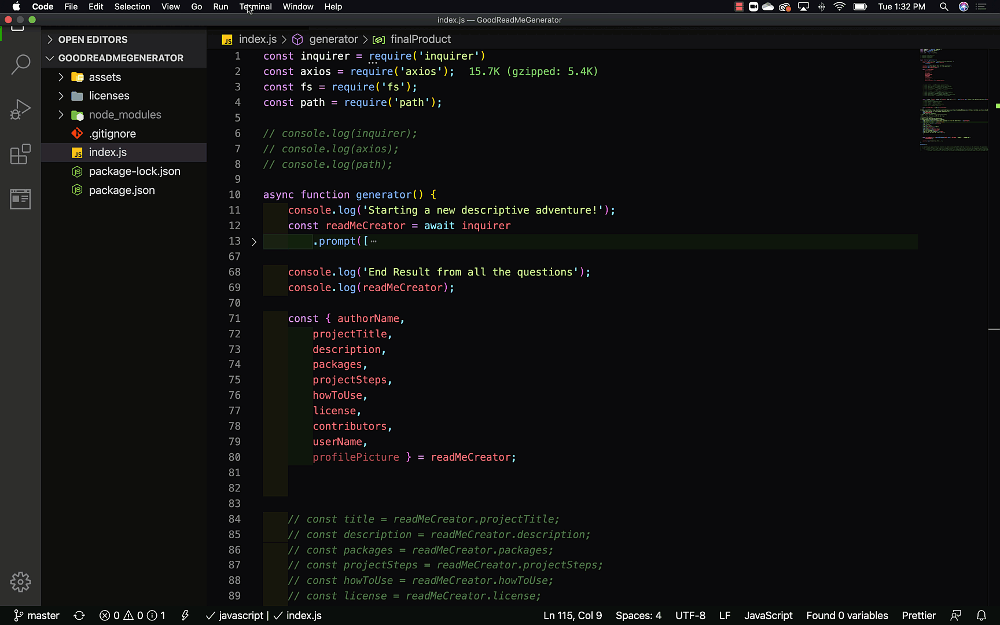

# Good ReadMe Generator
    

    
## Description of this ReadMe Generator/CLI
    
Creating an application or function to help create a ReadMe with the vitality to be effective.The generator will be structured in a specific form to maximize transfer of information from handler to user. Also to format all my ReadMe to have same fundamentals. Easy to understand!!!!
    
## Table of Contents
- [What you'll need to run program](#install)
- [How to Use Application](#step-By-step)
- [License](#license)
- [How to use Application](#howToUse)
- [Contributors](#contributors-/-Credits)
    
## Install
You will need these packages to run the Generator
 * node, axios and inquirer
    
## Step By Step
 * Open your folder and your terminal within your code editor and run npm init -y, npm i axios, and npm i inquirer.
    
## How to Use
 * Make sure you have Node installed. Download the following packages, node_modules, axios and inquirer. In your terminal simply run node and the name of your file like so, 'node index.js'. Follow and answer all the questions as detail as possible.

 ## Example 
 * 
    
## License
    
 * MIT
    
## Contributors / Credits
    
 * Kit Te
    
## Author
 * Christopher Rojas
    

    
## Git Hub User Name
 * sfcarz
    
## Author Git Hub URL Link
(https://github.com/sfcarz)
    